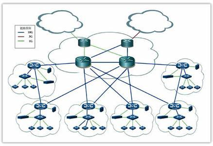

# 分布式开发系统

    

## 整合MongoDB
    Mongodb是一款很流行文档型数据库

## 整合Redis
    Redis是一款很流行的缓存型数据库

## 整合MySQL
    MySQL是关系型数据库

## 整合MyBatis
    MyBatis作为对象-关系型数据库持久层框架

## 整合WebService

## 整合WebSocket
    WebSocket作为消息通信机制的Web系统